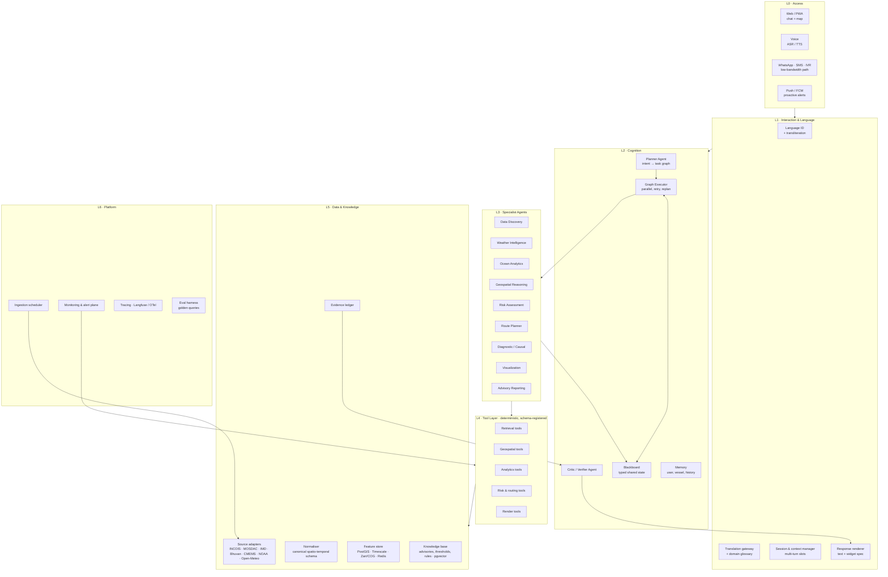
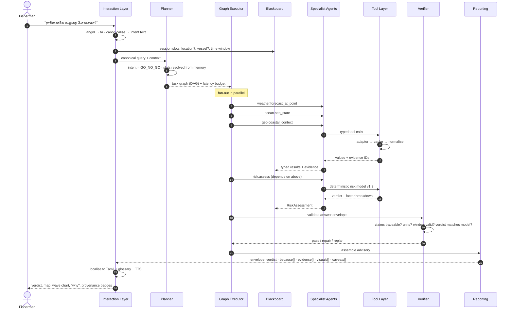
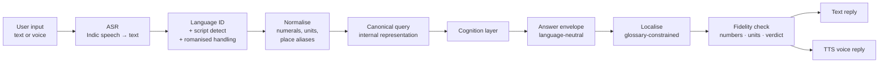
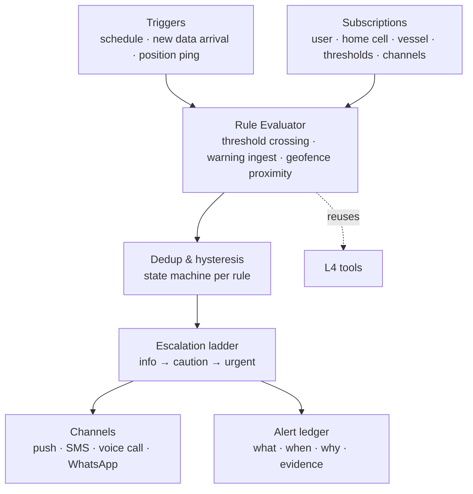

# ORCA 2.0 — System Architecture

**Ocean Reasoning & Coastal Advisory**
Agentic AI Marine Intelligence Platform — conversational decision support over satellite Earth Observation, oceanographic and meteorological data.

| | |
|---|---|
| Document status | Design baseline, v2.0-draft |
| Date | 2026-09-02 |
| Scope | Full system architecture: cognition, agents, tools, data, reasoning models, delivery |
| Companion docs | [`docs/REASONING-MODELS.md`](docs/REASONING-MODELS.md), [`docs/DATA-SOURCES.md`](docs/DATA-SOURCES.md), [`docs/QUERY-WALKTHROUGHS.md`](docs/QUERY-WALKTHROUGHS.md) |
| Traceability | Every requirement in the problem statement is mapped in [§16 PS Compliance Matrix](#16-ps-compliance-matrix) |

---

## 1. What we are actually building

The problem statement asks for a conversational platform, but the product is not a chat window and not a data portal. The product is a **reasoning layer** that sits between a human sentence and a dozen unrelated marine datasets, and whose output is a *decision with its evidence attached*.

Three properties define success, and the architecture is organised around them:

**Autonomy that is visible.** The system decides for itself which datasets a question needs, in what order, and how to combine them. A fixed if-else pipeline dressed in agent vocabulary fails the brief. The counter-design here is a **planner that emits a task graph as data** — a structure we can display, replay, cache, and audit — so autonomy is provable rather than asserted.

**Fusion, not lookup.** "Is it safe tomorrow morning?" is not a field in any dataset. It is wave height, swell period and direction, wind gusts, convective instability, visibility, distance from shore, vessel class and daylight, combined against thresholds. The architecture therefore separates *retrieval* (many adapters) from *analytics* (deterministic engines) from *judgement* (a versioned risk model) from *narration* (the LLM).

**Explainability as a data structure.** Because this system gives safety-of-life advice to fishermen, no claim may exist without a traceable origin. Every number that reaches the user carries an **evidence record** naming its source product, grid cell, timestamp and retrieval time. The response assembler will refuse to emit an unsourced numeric claim. This is a hard architectural constraint, not a UI feature, and it is far cheaper to build in on day one than to retrofit.

### 1.1 Non-negotiable design principles

1. **The model plans and explains; tools compute.** Distances, thresholds, interpolations, trends, routing and geofence tests run in deterministic Python. The LLM never performs arithmetic that reaches the user. This is the primary defence against hallucinated safety advice.
2. **Every claim carries evidence.** Evidence IDs propagate from adapter to answer. No evidence, no claim.
3. **The plan is a first-class artifact.** Stored, streamed to the UI, replayable, and diffable between runs.
4. **Agents share a typed blackboard, not a chat log.** Free-text agent-to-agent gossip degrades information and inflates cost; structured state does not.
5. **Judgement is versioned configuration, not prompt text.** Risk thresholds live in YAML with a version number so a verdict can be reproduced and defended.
6. **Language is a boundary concern.** Internally the system reasons in one canonical representation; detection and localisation happen at the edges.
7. **Degradation is explicit.** A missing or stale source produces a visible provenance state — `live`, `cached`, `stale`, `proxy`, `unavailable` — never a silent substitution.
8. **Proactive monitoring is a separate plane** that reuses the same tools, because push alerts cannot be a side effect of request/response.
9. **One space, one time.** All geometry normalises to EPSG:4326 with an H3 cell index; all time is stored UTC and rendered IST.
10. **Assume the user is offline, on a 2G edge, and possibly cannot read.** Voice and an SMS-sized answer path are architectural inputs, not later additions.

---

## 2. Layered view



The load-bearing idea in this diagram is the narrow waist at **L4**. Agents do not touch HTTP, files, or CRS transforms directly; they select from a registry of typed tools. That single constraint gives us testability, caching, cost control, replayable demos, and the ability to swap a fragile government endpoint for a fallback without touching agent logic.

---

## 3. Request lifecycle



Two details worth noting. First, the **verifier runs before rendering, not after** — it can force a repair or a replan, which is what makes the loop agentic rather than linear. Second, the fan-out is explicit in the graph, which is how a five-source answer still lands inside a latency budget (§13).

---

## 4. Cognition layer

### 4.1 Planner Agent

The planner is the only component allowed to decide *what work happens*. It performs four jobs.

**Intent classification** into a closed taxonomy, because open-ended intent invites unbounded behaviour:

| Intent | Meaning | Typical PS query |
|---|---|---|
| `PFZ_LOCATE` | Find fishing opportunity near a point | "Where is the nearest PFZ today?" |
| `GO_NO_GO` | Safety judgement for a departure window | "Is it safe to venture tomorrow morning?" |
| `CONDITIONS_AT_POINT` | Current/forecast state at a location | "Tide, weather and sea conditions near my spot" |
| `HAZARD_ALERT_QUERY` | Active warnings in an area | "Any lightning or cyclone alerts?" |
| `SPATIAL_SEARCH` | Multi-variable hotspot search over a region | "High chlorophyll with favourable SST" |
| `ROUTE_PLAN` | Safest path between points | "Safest route for my vessel" |
| `DIAGNOSTIC` | Causal explanation of a change over time | "Why has fish productivity declined?" |
| `BOUNDARY_CHECK` | Restricted / prohibited zone reasoning | "Which zones should I avoid?" |
| `CLARIFY` | Insufficient slots to proceed | — |
| `META` | Capability, source, or trust questions | "Where did this data come from?" |

**Slot resolution.** Every intent declares required and optional slots — `location`, `time_window`, `vessel_profile`, `region`, `radius`, `baseline_period`, `destination`. The planner fills them from the utterance, then session memory, then user profile, and only then asks the user. A question to the user is a planning *failure mode*, acceptable but minimised.

**Graph construction.** Output is a DAG, not a script:

```jsonc
{
  "plan_id": "pl_01J8...",
  "intent": "GO_NO_GO",
  "goal": "Decide departure safety for 2026-09-03 05:00–11:00 IST for an FRP motorised boat off Rameswaram",
  "latency_budget_ms": 8000,
  "steps": [
    { "id": "s1", "agent": "geospatial",  "tool": "geo.resolve_place",
      "args": { "text": "Rameswaram" }, "depends_on": [],
      "why": "Convert the named landing centre into coordinates and a wet-cell snap" },
    { "id": "s2", "agent": "weather",     "tool": "wx.forecast_point",
      "args": { "point": "$s1.point", "window": "$slots.time_window",
                "vars": ["wind_speed_10m","wind_gusts_10m","cape","visibility","precipitation"] },
      "depends_on": ["s1"], "why": "Atmospheric drivers of the safety verdict" },
    { "id": "s3", "agent": "ocean",       "tool": "ocean.sea_state_point",
      "args": { "point": "$s1.point", "window": "$slots.time_window",
                "vars": ["wave_height","swell_height","swell_period","swell_direction","current_speed"] },
      "depends_on": ["s1"], "why": "Sea-state drivers, including swell surge risk" },
    { "id": "s4", "agent": "data_discovery", "tool": "advisory.active_warnings",
      "args": { "point": "$s1.point", "radius_km": 200 }, "depends_on": ["s1"],
      "why": "Official INCOIS/IMD warnings override model-derived judgement" },
    { "id": "s5", "agent": "risk",        "tool": "risk.assess_departure",
      "args": { "weather": "$s2", "sea_state": "$s3", "warnings": "$s4",
                "vessel": "$slots.vessel_profile" },
      "depends_on": ["s2","s3","s4"], "why": "Apply versioned threshold model to produce a verdict" },
    { "id": "s6", "agent": "visualization", "tool": "viz.timeseries_panel",
      "args": { "series": ["$s3.wave_height","$s2.wind_gusts_10m"], "mark_window": "$slots.time_window" },
      "depends_on": ["s5"], "why": "Show the user when conditions cross the threshold" },
    { "id": "s7", "agent": "reporting",   "tool": "report.advisory",
      "args": { "assessment": "$s5", "visuals": ["$s6"], "locale": "$ctx.locale" },
      "depends_on": ["s5","s6"], "why": "Assemble a sourced, localised advisory" }
  ]
}
```

**Replanning.** The executor returns failures to the planner with a typed reason, and the planner may substitute a source, widen a search radius, drop an optional branch to stay inside budget, or escalate to the user. Replan events are recorded in the trace — they are evidence of autonomy and worth surfacing in a demo.

### 4.2 Graph Executor

A dependency-ordered executor with parallel fan-out, per-step timeout, bounded retry with jittered backoff, memoisation on `(tool, canonical_args)`, and a global budget guard that degrades gracefully by pruning steps marked `optional`. It writes every result to the blackboard and emits a streaming event per state change so the UI can show the plan filling in live.

### 4.3 Blackboard

Typed, append-only, per-conversation state: resolved slots, step outputs, evidence IDs, active hypotheses, agent notes, and provenance flags. Agents read what they need and write what they produced. Nothing is passed as prose between agents. This keeps token cost proportional to the data actually needed and makes each agent independently unit-testable.

### 4.4 Critic / Verifier Agent

A gate, not an advisor. It runs a checklist and can fail a response:

| Check | Failure action |
|---|---|
| Every numeric claim resolves to an evidence ID | Repair: drop or re-source the claim |
| Units and CRS consistent across combined values | Repair via tool re-invocation |
| Forecast validity window covers the requested window | Replan with fresher data or downgrade confidence |
| Stated verdict equals the risk model's verdict | Hard fail — regenerate narration only |
| Required data missing | Convert to explicit uncertainty statement; never infer |
| Safety-of-life language present where advice is given | Inject disclaimer |
| Localised text preserves numbers, units and verdict | Re-render, spot-check by round-trip |

### 4.5 Memory

Three tiers: **session** (slots, last location, referents for "there", "that zone"), **user profile** (home port, vessel class, draft, range, engine, preferred language, alert subscriptions, literacy/voice preference), and **long-term** (past trips, past advisories issued, feedback). Profile memory is what makes "is it safe tomorrow?" answerable without twenty questions.

---

## 5. Specialist agents

The PS names the roster; this is the contract for each. Every agent is a bounded reasoner over a small tool set, with a declared output type.

### 5.1 Data Discovery Agent
**Mission.** Decide which sources can answer a need, in what priority, and with what freshness — then fetch through adapters.
**Reasons about.** Source capability matrix (variable × region × horizon × latency), current health, licence constraints, and whether an official advisory exists that should outrank a model field.
**Tools.** `catalog.search`, `adapter.fetch`, `advisory.active_warnings`, `advisory.parse_bulletin`, `cache.lookup`.
**Output.** `SourceResolution` + raw records with provenance state.
**Key behaviour.** Prefers *official* Indian sources for anything with legal or advisory standing (INCOIS high-wave alerts, IMD cyclone warnings, PFZ bulletins), and keyless global models for continuous fields. When it falls back, it says so in the provenance chain rather than quietly swapping.

### 5.2 Weather Intelligence Agent
**Mission.** Atmospheric state and forecast: wind, gusts, precipitation, convective instability, visibility, pressure, cyclone tracks, lightning risk.
**Tools.** `wx.forecast_point`, `wx.forecast_grid`, `wx.cyclone_tracks`, `wx.convective_risk`, `wx.nowcast_bulletin`.
**Output.** `WeatherWindow` — hourly series with units and evidence per variable.
**Honesty rule.** Where a true lightning-strike feed is unavailable, it returns a **convective proxy** (CAPE, precipitation intensity, thunderstorm probability) explicitly typed as `proxy`, and the reporting layer must render it as such. Claiming strike detection we do not have is both a safety and a credibility failure.

### 5.3 Ocean Analytics Agent
**Mission.** Sea state and ocean biology/physics: significant wave height, swell components, period and direction, currents, SST, chlorophyll, fronts, anomalies, mixed-layer proxies, tide.
**Tools.** `ocean.sea_state_point`, `ocean.grid_subset`, `ocean.front_detect`, `ocean.anomaly_vs_climatology`, `ocean.tide_predict`, `ocean.observed_sea_level`.
**Output.** `SeaState`, `GridField`, `FrontSet`, `TideSeries`.
**Signature capability.** Frontal-gradient detection on SST and chlorophyll fields — this is what allows a *derived* fishing-zone recommendation when the official PFZ bulletin is absent (common during monsoon cloud cover), and it is one of the strongest demonstrations of reasoning over raw EO data rather than reading a table.

### 5.4 Geospatial Reasoning Agent
**Mission.** Everything spatial: place resolution, distance and bearing, nearest-feature search, wet-cell snapping, polygon containment and proximity, buffers, coastline and bathymetry context, H3 indexing.
**Tools.** `geo.resolve_place`, `geo.snap_to_water`, `geo.nearest`, `geo.distance_bearing`, `geo.zone_test`, `geo.buffer_proximity`, `geo.bathymetry_profile`.
**Output.** `SpatialContext`, `ZoneVerdict`.
**Why it is separate.** Coastal geometry is where naive implementations break: a village centroid sits on land, marine grids return null there, and the answer silently becomes "no data". Snapping, depth checks and shoreline distance belong in one auditable place.

### 5.5 Risk Assessment Agent
**Mission.** Convert fields into a defensible verdict for *this vessel* in *this window*.
**Tools.** `risk.assess_departure`, `risk.route_segment_risk`, `risk.hazard_overlay`, `risk.explain_factors`.
**Output.** `RiskAssessment { verdict: GO | CAUTION | NO_GO, score, factors[], model_version, valid_until, overriding_warning? }`
**Hard rule.** The verdict comes from a versioned deterministic model (see `docs/REASONING-MODELS.md`), and any official warning in force **overrides** a model-derived GO. The LLM's role is limited to narrating the factor breakdown.

### 5.6 Route Planner Agent
**Mission.** Safe path, not shortest path — time-dependent least-cost routing over a hazard surface.
**Tools.** `route.build_cost_surface`, `route.solve`, `route.profile_risk`, `route.waypoint_advisories`.
**Output.** `Route { polyline, waypoints, eta, segment_risks[], avoided_zones[], fuel_or_range_check }`

### 5.7 Diagnostic / Causal Agent
**Mission.** Answer *why* — the hardest query class in the PS, and the clearest differentiator.
**Method.** Generate a hypothesis set (warming/marine heatwave, chlorophyll decline, weakened upwelling, monsoon and river-discharge shift, cyclone disturbance, frontal displacement, fishing pressure), pull multi-year series, compute anomalies against climatology, run trend tests and lagged correlations, then **rank hypotheses by evidence strength while naming confounders and missing data**.
**Tools.** `ts.fetch_climatology`, `ts.trend_test`, `ts.anomaly`, `ts.lagged_correlation`, `effort.fishing_pressure`, `kb.retrieve_literature`.
**Output.** `Diagnosis { ranked_hypotheses[], evidence_per_hypothesis[], confounders[], unavailable_data[], confidence }`
**Discipline.** It states plainly that correlation is not causation and never asserts a single cause where the data supports several.

### 5.8 Visualization Agent
**Mission.** Choose and specify the right visual, not draw it. Emits a declarative widget spec that the client renders.
**Tools.** `viz.map_spec`, `viz.timeseries_panel`, `viz.raster_layer`, `viz.route_overlay`, `viz.gauge`.
**Output.** `WidgetSpec[]` — layer definitions, colour ramps with units, legends, threshold markers, and the evidence IDs behind each layer.

### 5.9 Advisory Reporting Agent
**Mission.** Assemble the final answer envelope: verdict, reasons each bound to evidence, visuals, caveats, provenance, and the plan trace. Produces three renditions from one envelope — full conversational, SMS/160-character, and voice script — so the low-bandwidth path is a projection of the same truth rather than a separate code path.

### 5.10 Alert & Monitor Agent (background plane)
**Mission.** Evaluate subscriptions on a schedule and on data arrival, detect threshold crossings and geofence approaches, deduplicate, escalate, and push. Detailed in §8.

---

## 6. Tool layer

Tools are the only path to data and mathematics. Each is registered with a JSON schema, a cost and latency class, a cache policy, and a declared provenance behaviour. Exposing them over **MCP** keeps them callable by agents, by the monitoring plane, and by tests without duplication.

```python
@tool(
    name="ocean.sea_state_point",
    cache_ttl=1800,                     # seconds
    cost_class="cheap_remote",
    latency_p95_ms=900,
    provenance="required",
)
def sea_state_point(
    point: LatLon,
    window: TimeWindow,
    vars: list[SeaStateVar],
) -> ToolResult[SeaState]:
    """Hourly sea-state at a point, snapped to the nearest marine grid cell.

    Returns values with per-variable evidence records. Raises SourceUnavailable
    rather than substituting a different product; substitution is the Data
    Discovery Agent's decision, not the tool's.
    """
```

Two conventions matter. **Tools never silently substitute sources** — escalation is an agent decision, recorded in the plan. And **every tool result is wrapped**:

```jsonc
{
  "value": { "wave_height": [{ "t": "2026-09-03T00:00Z", "v": 1.8, "unit": "m" }] },
  "evidence": [{
    "id": "ev_7f3a", "variable": "wave_height", "value": 1.8, "unit": "m",
    "source_id": "openmeteo_marine", "product": "marine-forecast",
    "official": false, "spatial_ref": { "lat": 9.25, "lon": 79.35, "snap_km": 4.1, "h3": "8661..." },
    "temporal_ref": { "valid_at": "2026-09-03T00:00Z", "issued_at": "2026-09-02T06:00Z" },
    "retrieved_at": "2026-09-02T08:12Z", "provenance_state": "live",
    "transform_chain": ["fetch", "unit_check", "bilinear_at_point"],
    "confidence": 0.82
  }]
}
```

Tool families: **retrieval** (adapters, advisory parsing, catalogue search), **geospatial** (resolve, snap, nearest, zone tests, bathymetry), **analytics** (subset, front detect, anomaly, trend, correlation), **decision** (risk, routing, geofence), **render** (widget specs, report assembly), and **notify** (push, SMS, voice).

---

## 7. Language and interaction layer

Auto-detection with reply in the same language, with emphasis on Indian regional languages, is an explicit PS requirement and is handled entirely at the boundary.



Design points that decide whether this actually works for a fisherman in Rameswaram or Paradip:

**Romanised and code-mixed input is the norm**, not the exception — "naalai kadal safe ah?" and "kal subah jaana theek hai?" must route correctly, so language ID must handle transliteration and mixed script rather than assuming clean Tamil or Devanagari.

**A domain glossary constrains translation.** Marine terms, landing-centre names, vessel types and hazard vocabulary get fixed translations per language; machine translation is not allowed to paraphrase "swell surge" or a place name freely. Priority languages follow the coastline: Tamil, Malayalam, Telugu, Odia, Bengali, Marathi, Gujarati, Konkani, Kannada, plus Hindi and English.

**The envelope is language-neutral.** Verdicts, numbers, units and evidence live in structured fields; only narration is generated per language. This means a Tamil answer and an English answer are provably the same advice — and the fidelity check verifies numbers and verdict survived localisation.

**Voice is first-class** because literacy cannot be assumed. The voice rendition is generated from the same envelope, leads with the verdict, and keeps to a strict length.

---

## 8. Proactive alerting and geofencing plane

The PS asks for proactive safety alerts and geofence notifications. Neither can live in the request path, so this is a separate always-on plane reusing L4 tools.



**Hysteresis is the difference between a useful system and one that gets muted.** Each rule is a state machine with separate trigger and clear thresholds and a minimum re-alert interval; a wave height oscillating around 2.0 m must not produce fourteen messages.

**Geofencing runs in two places.** Server-side for subscribed positions, and **on-device** with a cached polygon pack, because the moment a boat approaches the International Maritime Boundary Line is exactly when connectivity is worst. The alert is actionable, not abstract: distance, bearing, and a suggested corrective heading — "IMBL 3.2 nm ahead on bearing 270°, turn to 090° to stay inside Indian waters."

Zone classes carried: EEZ, IMBL advisory line, MPAs and ecologically sensitive areas, port limits and anchorages, defence exclusion areas, seasonal fishing bans, and custom operator boundaries. Buffered warning rings (typically 10 / 5 / 2 nm) drive escalation. Because official Indian maritime-limit vectors are not freely published, every boundary is rendered with its source and a **"advisory only, not for navigation"** disclaimer — an accuracy point that also protects the project.

---

## 9. Data and knowledge layer

Full source registry, adapter contracts and a verification checklist are in [`docs/DATA-SOURCES.md`](docs/DATA-SOURCES.md). The architectural shape:

**Adapter pattern.** One interface, many implementations: `capabilities()`, `fetch(request)`, `health()`, `licence()`. Indian official sources (INCOIS, MOSDAC, IMD, Bhuvan) sit behind the same interface as keyless global models, so the Data Discovery Agent chooses on capability and health rather than on code paths. Fragile HTML/PDF bulletin sources get parser adapters with strict schema validation and quarantine on parse failure — a changed page must produce `unavailable`, never a wrong number.

**Normalisation.** Everything lands in one canonical form: variable name from a controlled vocabulary, SI units, EPSG:4326, UTC, H3 cell, and a source/product/issue-time triple. Unit conversion happens once, here, and is asserted in tests — because a knot/metre-per-second mix-up in a safety verdict is the most likely serious bug in this system.

**Storage tiers.** PostGIS for vector zones and features; TimescaleDB for point time series; Zarr and Cloud-Optimised GeoTIFF for gridded fields with a tile server in front; Redis for hot tool-result cache; pgvector for the knowledge base of advisories, threshold documents, domain rules and literature; and the append-only **evidence ledger** in Postgres.

**Ingestion.** Scheduled pulls per source cadence, plus pre-warmed subsets over the Indian EEZ so interactive queries hit local storage rather than remote APIs. Precomputed **coastal advisory bundles** per H3 cell support both the SMS path and instant common answers.

---

## 10. Explainability contract

The single artifact that reaches the interaction layer:

```jsonc
{
  "answer_id": "ans_01J8...",
  "intent": "GO_NO_GO",
  "verdict": { "value": "CAUTION", "confidence": 0.78, "valid_until": "2026-09-03T11:00Z" },
  "headline": "You can go, but return before 09:00 — swell builds after mid-morning.",
  "because": [
    { "text": "Wave height 1.8 m at 05:00, rising to 2.6 m by 10:00",
      "evidence": ["ev_7f3a", "ev_7f3b"], "factor": "wave_height", "breach": "threshold_2.0m_at_09:30" },
    { "text": "Wind gusts up to 32 km/h from the southwest", "evidence": ["ev_91c2"], "factor": "wind_gusts" },
    { "text": "No INCOIS high-wave alert in force for Ramanathapuram district",
      "evidence": ["ev_aa10"], "factor": "official_warning", "official": true }
  ],
  "evidence": [ /* full records, see §6 */ ],
  "visuals": [ { "type": "timeseries", "spec_ref": "w_1" }, { "type": "map", "spec_ref": "w_2" } ],
  "caveats": [
    "Lightning risk is inferred from convective instability, not a strike-detection network.",
    "Forecast issued 06:00 UTC today; re-check before departure."
  ],
  "provenance": [
    { "source": "Open-Meteo marine", "state": "live", "official": false },
    { "source": "INCOIS OSF bulletin", "state": "cached", "age_min": 46, "official": true }
  ],
  "plan_trace_ref": "pl_01J8...",
  "disclaimer": "Advisory support only. Follow official INCOIS/IMD warnings and local authority instructions."
}
```

The UI exposes a **"Why this answer"** panel rendering the plan DAG, the factor breakdown against thresholds, and per-source provenance badges. This panel is simultaneously the explainability requirement, the trust mechanism for a sceptical fisherman, and the single most persuasive thing to show an evaluator.

---

## 11. Client architecture

A React/Next PWA with a **split chat-and-canvas layout**: conversation on one side, a MapLibre GL canvas with deck.gl overlays on the other, and widgets pushed by the Visualization Agent. Server-sent events stream plan steps as they execute, so the user watches the system decide — retrieving winds, checking boundaries, assessing risk — instead of staring at a spinner. Map layers carry legends with units and a provenance chip. The PWA caches the latest advisory bundle, boundary polygon pack and last-known conditions for the user's cell, so the app degrades to something useful offline rather than blank.

---

## 12. Recommended stack

| Concern | Choice | Why this, and the alternative considered |
|---|---|---|
| Orchestration | **LangGraph** (or a ~400-line custom DAG executor) | Explicit graph with typed state matches our plan-as-data principle. A free-running ReAct loop is less demonstrable and harder to bound; if LangGraph's abstractions fight us, the custom executor is genuinely small. |
| Tool exposure | **MCP** servers per tool family | One registry serves agents, monitors and tests. |
| Backend | **Python 3.12 + FastAPI**, async | The geospatial and scientific stack is Python-native; no bridge needed. |
| LLM | Frontier API for planning and narration; small Indic-capable model for classification and localisation | Split by task: planning needs reasoning, language ID does not. Keep a provider-abstraction so the demo cannot be sunk by one API outage. |
| Rasters | **xarray + rioxarray + Zarr/COG**, TiTiler for tiles | Server-side subsetting and cheap tiling. |
| Vectors | **PostGIS + GeoPandas/Shapely/pyproj + H3** | Prepared geometries make geofence tests fast enough for per-ping evaluation. |
| Time series | **TimescaleDB** | Climatology and trend queries over decades. |
| Routing | Custom time-dependent A* over an H3/grid graph via **NetworkX** or direct arrays | Off-the-shelf marine routers are not available openly; the cost surface is domain-specific anyway. |
| Scheduling | **APScheduler** for the hackathon, **Temporal** if this hardens | Monitoring plane needs durable, observable jobs. |
| Cache/queue | **Redis** | Tool memoisation and alert dedup state. |
| Frontend | **Next.js + MapLibre GL + deck.gl + Recharts** | Open, no key, handles raster tiles and large vector overlays. |
| Speech | Indic ASR (Whisper-family fine-tunes / IndicWhisper) + Indic TTS | Voice-first for low-literacy users. |
| Translation | IndicTrans2-class model, glossary-constrained | Better Indic coverage than generic MT; glossary prevents term drift. |
| Observability | **OpenTelemetry + Langfuse** | Per-step traces are both debugging and the "show your reasoning" artifact. |
| Evaluation | Golden-query harness with recorded fixtures | See §14. |

---

## 13. Latency budget

Chained agents are the obvious way to lose a live demo. Budget explicitly:

| Query class | Target p95 | How it is met |
|---|---|---|
| Cached simple (`CONDITIONS_AT_POINT`) | < 1.5 s | Pre-warmed EEZ subsets, Redis memoisation, no remote call |
| `GO_NO_GO` | < 5 s | Parallel fan-out of 3–4 tools, local risk model |
| `SPATIAL_SEARCH` | < 8 s | Pre-tiled chlorophyll/SST grids, vectorised search |
| `ROUTE_PLAN` | < 12 s | Cost surface precomputed per forecast cycle; solver on coarse graph then refine |
| `DIAGNOSTIC` | < 25 s, streamed | Stream hypothesis-by-hypothesis so the user sees progress |

Techniques: aggressive pre-warming over the Indian EEZ, parallel-by-default execution, step-level caching, coarse-to-fine spatial search, and streaming partial answers with the verdict first.

---

## 14. Quality, safety and evaluation

**Golden-query harness.** Fifty-plus queries across all intents and languages, each with recorded source fixtures, asserting: correct intent, correct tool selection, verdict within tolerance of a hand-computed expectation, every claim evidence-backed, and localisation preserving numbers. This is what lets you refactor the planner two days before a deadline without fear.

**Record-and-replay fixtures.** Every adapter can run in replay mode from recorded payloads. This gives deterministic demos, offline development, and regression tests — and it means a government portal going down mid-presentation is survivable.

**Safety review checklist.** Thresholds validated against official criteria before any public claim; proxies labelled as proxies; official warnings always override model verdicts; no advice emitted under missing critical data; disclaimer on every advisory and every route.

**Bias toward refusal.** For safety intents the system must be comfortable saying "I don't have reliable wave data for this location and time — do not rely on me for this departure." A system that always answers is a system that sometimes lies.

---

## 15. Delivery phases

| Phase | Outcome | Contents |
|---|---|---|
| **P0 — Spine** | One query end-to-end, honestly | Tool layer + 2 adapters, blackboard, executor, planner with 2 intents, evidence ledger, chat+map shell. `CONDITIONS_AT_POINT` and `GO_NO_GO` working with real data. |
| **P1 — Breadth** | All eight PS queries answerable | Remaining agents, PFZ derivation, spatial search, boundary checks, visualization specs, verifier. |
| **P2 — Reach** | Safety and access requirements | Monitoring plane, geofencing with on-device pack, multilingual + voice, SMS projection, PWA offline bundle. |
| **P3 — Depth** | The differentiators | Diagnostic/causal agent, route planner, plan-trace UI, provenance badges. |
| **P4 — Proof** | Demo-hard | Golden-query harness, replay fixtures, latency tuning, warm caches, failure drills. |

Sequencing logic: build the spine and the evidence contract first because everything else attaches to them; do the differentiators (P3) only once breadth exists, since a demo that answers seven questions shallowly and one deeply beats a system that answers one question beautifully.

---

## 16. PS Compliance Matrix

| Problem-statement requirement | Where it is handled |
|---|---|
| Understand natural-language intent | §4.1 Planner, closed intent taxonomy + slot resolution |
| Auto-detect language, reply in same language, Indian regional emphasis | §7 boundary language layer, glossary-constrained localisation, fidelity check |
| Contextual multi-turn conversation, query refinement | §4.3 Blackboard, §4.5 session memory with referent resolution |
| Autonomous planning and task decomposition | §4.1 plan-as-DAG, §4.2 executor with replanning |
| Autonomous tool selection | §6 typed tool registry, §5.1 Data Discovery capability matching |
| Collaboration among specialised agents | §5 roster over shared typed blackboard |
| Discover, retrieve, integrate satellite / marine / met / geospatial data | §5.1, §9 adapters + normaliser + feature store |
| Spatial, temporal and contextual correlation across heterogeneous sources | §5.3 Ocean Analytics, §5.4 Geospatial, §5.7 Diagnostic; canonical space-time index in §9 |
| Explainable, evidence-based recommendations | §1.1 principle 2, §6 evidence records, §10 answer envelope, §4.4 verifier |
| Maps, charts, geospatial visualisations, advisories | §5.8 Visualization, §5.9 Reporting, §11 client canvas |
| Proactive alerts — weather, high waves, lightning, cyclone | §8 monitoring plane with hysteresis and escalation |
| Geofencing near IMBL, restricted waters, MPAs, sensitive zones | §8 zone classes, buffered rings, on-device polygon pack |
| Route optimisation and safe navigation | §5.6 Route Planner, cost-surface model in `docs/REASONING-MODELS.md` |
| Reliable recommendations with supporting evidence and reasoning | §10 envelope + "Why this answer" plan-trace panel |
| Modular multi-agent architecture | §2 layered view, §5 agent contracts, §6 narrow tool waist |

---

## 17. Risk register

| Risk | Severity | Mitigation |
|---|---|---|
| Official Indian endpoints are HTML/PDF or gated, and may change | High | Parser adapters with schema validation and quarantine; fallback chain with visible provenance; register for MOSDAC/CMEMS/Earthdata on day one |
| Hallucinated safety numbers | Critical | Tools compute, model narrates; verifier blocks unsourced claims; deterministic versioned risk model |
| No open Indian lightning-strike feed | Medium | Convective proxy, explicitly labelled; never claim strike detection |
| No free global tide-forecast API | Medium | Offline harmonic tide computation; observed sea level from tide-gauge feeds where available |
| Marine grids return null at coastal points | Medium | `geo.snap_to_water` with documented snap distance in evidence |
| Latency of chained agents | Medium | §13 budget, parallel fan-out, pre-warmed subsets, streaming verdict-first |
| Boundary data licensing and depiction sensitivity | Medium | Advisory-only rendering, explicit attribution, non-navigational disclaimer |
| "Agent-washing" perception | Medium | Displayed plan DAG, variable graphs per query, visible replanning events |
| Demo-time network failure | Medium | Replay fixtures and warm caches (§14) |
| Catch/landings data only in PDF reports | Low | Hand-extract a small series for one region; state scope limits in the diagnosis |

---

## 18. Open decisions

These need a call before P1 hardens: whether to commit to LangGraph or the custom executor; which LLM provider is primary and what the offline fallback is; the initial language set for P2 (recommend Tamil, Malayalam, Odia, Hindi, English first, matching the highest-density fishing coastlines); whether vessel profiles are self-declared or drawn from a registry; and how far the diagnostic agent may go without validated catch data.
